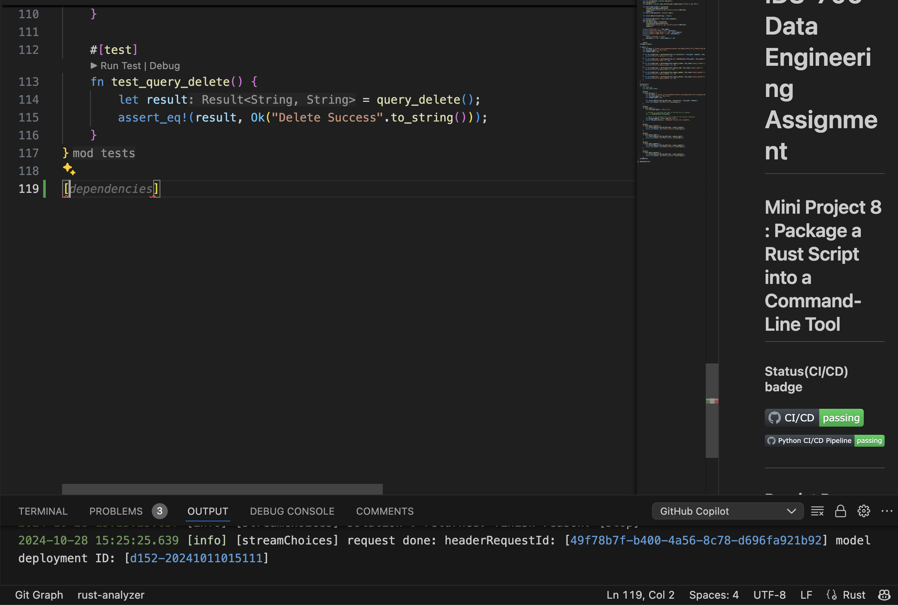

# IDS-706 Data Engineering Assignment
## Individual Project 2 : Package a Rust Script into a Command-Line Tool

#### Status(CI/CD) badge 
[](https://github.com/nogibjj/Mini_PJT_8_Transitioning_from_Python_to_Rust/actions/workflows/Rust.yaml)
[](https://github.com/nogibjj/Mini_PJT_8_Transitioning_from_Python_to_Rust/actions/workflows/Python.yml)

------

### Proejct Purpose

- The purpose of this project is to perform Extract, Transform, and Load (ETL) operations, comparing the performance of Rust and Python. I am using IBM's employee attrition dataset, downloaded as a CSV file from a URL, and I implemented data-cleaning functionality using SQL queries.

-----

### Requirements

* ***Take an existing Python script for data processing***
* ***Rewrite it in Rust***
* ***Highlight improvements in speed and resource usage***

### Deliverables

* ***Rust and Python scripts***
* ***Performance comparion report(PDF or markdown)***

---------
### Project Structure
```
Mini_PJT_8_Transitioning_from_Python_to_Rust
├─ .DS_Store
├─ .coverage
├─ .devcontainer
│  ├─ Dockerfile
│  └─ devcontainer.json
├─ .github
│  └─ workflows
│     ├─ Python.yml 
│     └─ Rust.yaml
├─ .gitignore
├─ Cargo.toml
├─ Data
├─ HR_1.csv
├─ HR_1.db
├─ Makefile
├─ README.md
├─ main.py
├─ mylib
│  ├─ extract.py        # [Python] Data extract & load
│  ├─ query.py          # [Python] CRUD
│  └─ transform.py      # [Python]
├─ requirements.txt
├─ src
│  ├─ lib.rs            # [Rust] Data extract & load, CRUD
│  └─ main.rs           # [Rust]
├─ test_comparison.txt  # Performance comparison result
└─ test_main.py
```
----------
###  ***Operation***
- Both programming languages(Python and Rust) process the data identically across six stages—Extract, Load, Create, Read, Update, and Delete—and compare their performance

#### **[1] Python**
- Data extract & load : `extract.py` extracts raw data(CSV extension) from the given URL, and `transform.py` creates a SQL table(db extension).
- CRUD(Create, Read, Updated and Delete) : `query.py`
   - Create(`queryCreate`) : Creates an SQL file and adds a new column to the existing 2,068 rows.
   - Read(`queryRead`) : Retrieves all data, creating a table with 2,069 rows and 10 columns.
   - Update(`queryUpdate`) : Assigns a value of '9999999' to any empty or null fields.
   - Delete(`queryDelete`) : Deletes records where Age is 18 or below, or EmployeeNumber is 99999.

#### **[2] Rust**
- Data extract & load : `lib.rs` and `main.rs`extracts raw data(CSV extension) from the given URL, and creates a SQL table(db extension).
- CRUD(Create, Read, Updated and Delete) : `lib.rs` and `main.rs`
   - Create(`queryCreate`) : Works the same as the Python query above
   - Read(`queryRead`) : Works the same as the Python query above
   - Update(`queryUpdate`) : Works the same as the Python query above
   - Delete(`queryDelete`) : Works the same as the Python query above

* ***Binary file as an artifact in CI/CD***
- Binary file is successfully released 
[Binary Articact Download](https://github.com/nogibjj/Mini_PJT_8_Transitioning_from_Python_to_Rust_ISL/actions/runs/11544607272/job/32130378632)

   

###  ***Performance Comparision*** 

- The performance test showed that Python overally outperformed Rust in both Execution Time and Memory Consumed for simple tasks. Although Rust has stricter memory management (evident in its lower "Memory Usage Before" values([Test_result](test_comparision.txt))), Python was faster and more efficient in this test with a small dataset (a 2000-row, 10-column table). For larger, more complex tasks, Rust's performance may differ.

| Programming Language    | Extract | Load   | Create | Read   | Update | Delete | Total   | Unit |
| ----------------------- | ------- | ------ | ------ | ------ | ------ | ------ | ------- | ---- |
| Python(Execution time)  | 231.50  | 12.99  | 0.83   | 0.33   | 3.41   | 1.05   | 250.11  | ms   |
| Rust(Execution time)    | 332.48  | 509.94 | 0.813  | 114.40 | 3.14   | 0.958  | 961.731 | ms   |
| Python(Memory Consumed) | 4544.00 | 816    | 0      | 0      | 16     | 16     | 5,392   | KB   |
| Rust(Memory Consumed)   | 6308.00 | 246    | 164    | 98     | 16     | 0      | 6,832   | KB   |


---------
### Testing
- Python
   
   
- Rust
   

---------
### Demo Video
(TBD)

---------
### Use of Github/Gitlab Copilot

- I installed GitHub Copilot on VS Code and used it to help convert my existing Python code into Rust. (The icon in the bottom right corner of the image shows that Copilot is installed.) When facing challenges with autocomplete, I also used ChatGPT for assistance.
   


----------
### Reference
* https://github.com/noahgift/rust-new-project-template/blob/main/README.md

